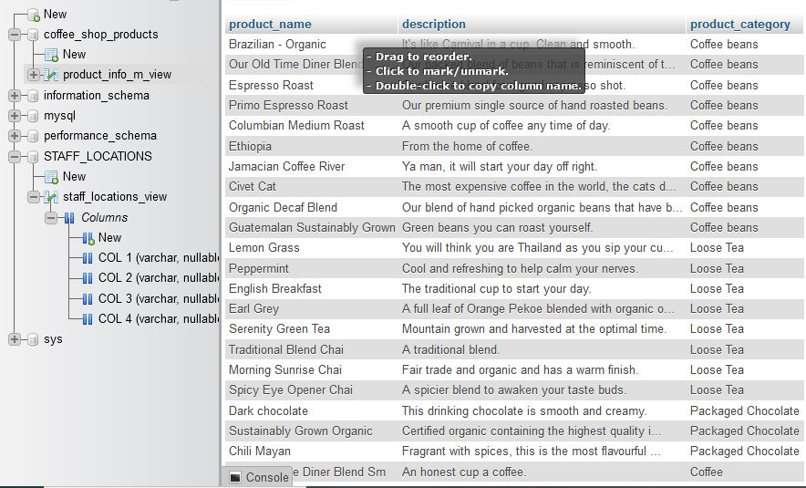

# Project-Database-Design-and-Implementation

## Scenerio

In my role as a Data Engineer for the New York-based coffee shop chain, I was tasked with streamlining operations and revamping the data infrastructure to support their national expansion through franchise locations.

To begin, I reviewed the data from several disparate systems, including accounting software, supplier databases, point of sales (POS) systems, and spreadsheets. My goal was to design a central relational database system that would house all the data, thereby improving operational efficiencies and enabling executives to make data-driven decisions.

I started by thoroughly analyzing the existing data in all these systems. Once I understood the data structures and relationships, I designed a central relational database schema that could integrate and manage the diverse datasets effectively.

Next, I created the necessary database objects, including tables, views, indexes, and relationships, to support the new database design. I then proceeded to extract data from the various source systems and loaded it into the central database, ensuring data integrity and consistency throughout the process.

After the central database was populated with source data, I focused on creating subsets of data tailored to the specific needs of different business partners. I exported these subsets and loaded them into staging databases that utilized different RDBMS, ensuring compatibility and accessibility for all stakeholders.

Throughout this project, I maintained close communication with my team and business partners to ensure that the new data infrastructure met their requirements and facilitated the coffee shop chain's expansion goals. This comprehensive approach laid a solid foundation for improved data management and operational efficiency, driving the company's growth and success.

## Objectives

- Identify entities.
- Identity attributes.
- Create an entity relationship diagram (ERD) using the pgAdmin ERD Tool.
- Normalize tables.
- Define keys and relationships.
- Create database objects by generating and running the SQL script from the ERD Tool.
- Create a view and export the data.
- Create a materialized view and export the data.
- Import data into a MySQL database.

## Sources of Data

- Staff information held in a spreadsheet at HQ
- Sales outlet information held in a spreadsheet at HQ
- Sales data output as a CSV file from the POS system in the sales outlets
- Customer data output as a CSV file from a bespoke customer relationship management system
- Product information maintained in a spreadsheet exported from the supplier’s database

## Tools Used

- PostgreSQL
- MySQL

## Task 1 - Identify entiries

Sample data from each of the data sources

**Entities**
1. Staff
2. Sales_outlet
3. Sales_transaction
4. Customer
5. Product

## Task 2 - Identity attributes

The attributes can be identified as the columns in each entity table. For example sales transaction attributes are as follows:
- Transaction_id
- Transaction_date
- Transaction_time
- Sales_outlet_id
- Staff_id
- Customer_id
- Product_id
- Quantity
- Price

## Task 3 & 4 - Create an entity relationship diagram (ERD) using the pgAdmin ERD Tool and Normalized tables

## Task 5 - Define keys and relationships

## Task 6 - Create database objects by generating and running the SQL script from the ERD Tool.

[SQL Script](https://github.com/Henryzeze/Project-Database-Design-and-Implementation/blob/main/GeneratedScript.sql)

## Task 7 - Create a view and export the data.

## Task 8 - Create a materialized view and export the data

## Task 9 - Import data into a MySQL database

